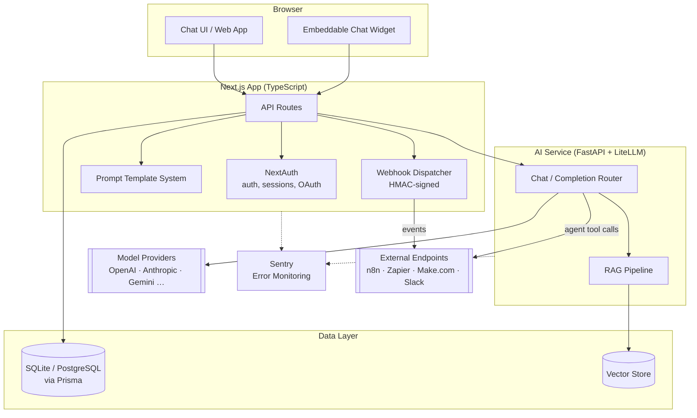

# Chimerai App

Built with ChimerAI Kickstart

```bash
npm install -g @chimerai/cli

chimerai create my-app --sqlite

```
## Admin Dashboard


## Manage Any AI Model Provider


## Manage Your Own AI Prompt Templates


# Chat Window - Free choice of model and prompt


# Upload your documents to the vector database


# Query the vector database for information


The command scaffolds a production-ready Next.js/TypeScript foundation for AI-powered applications — no Docker required, ready to run with SQLite as the database.

## Features

- 🔐 Authentication with NextAuth
- 🔌 AI Model Provider Management
- 📝 Prompt Template System
- 💬 AI Chat Interface
- 🔍 RAG / Vector Store
- 🚨 Sentry Error Monitoring


## Architecture



### The AI Service runs independently

The AI Service is not just an internal helper for the bundled web app — it's a standalone FastAPI service with its own REST API (default port `8002`), separate from the Next.js frontend and deployable on its own. Any of your other applications or scripts can call it directly over HTTP: chat completions, RAG queries, and the rest of the AI functionality are all exposed as regular REST endpoints, not tied to the Next.js UI in any way.

- **Auth:** requests are secured with a Bearer token (`INTERNAL_SERVICE_TOKEN`) — set it once and any authorized client can call in
- **Interactive API docs:** auto-generated OpenAPI/Swagger UI at `/docs` (and the raw schema at `/openapi.json`), so you can explore and test every endpoint without writing a client first
- **Health check:** `GET /health` for monitoring and orchestration

This makes it straightforward to reuse the same AI backend across multiple frontends, internal tools, or automation scripts — you're not limited to calling it through the generated web app.

The generated stack covers the core building blocks of a modern AI app:

- **Chat interface (`chat-ui`)** – streaming chat UI built on Next.js, ready to use out of the box
- **RAG pipeline (`rag`)** – Retrieval-Augmented Generation with vector search over your own knowledge sources
- **Model provider management (`model-providers`)** – unified integration for OpenAI, Anthropic, Gemini, and others, with easy provider switching
- **Prompt template system (`prompt-management`)** – versionable, reusable prompt templates
- **Authentication (`auth`)** – NextAuth-based login with sessions, email, and OAuth (GitHub, Google, Facebook)
- **Sentry monitoring (`sentry`)** – error tracking built in from the start
- **SQLite or PostgreSQL + Prisma** – choose the database that fits your use case
- **Docker-ready & self-hostable**

The generated code is entirely yours — MIT licensed, no attribution required.

## Getting Started

### Prerequisites

- Node.js 20+
- Docker Desktop
- npm

### Quick Start (Recommended)

**Windows:**
```bash
install.bat
```

**Linux/macOS:**
```bash
./install.sh
```

The install script will automatically:
- Install dependencies
- Start Docker containers
- Setup and seed the database
- Show you the next steps

### Manual Installation

If you prefer to run commands manually:

```bash
# Install dependencies
npm install

# Start Docker services
docker-compose up -d

# Setup database
npm run db:push
npm run db:seed

# Start development server
npm run dev
```

Open [http://localhost:3001](http://localhost:3001) in your browser.

### Default Admin Credentials

- Email: admin@example.com
- Password: admin123

⚠️ Change these in production!

### OAuth Setup

Email/password login works out of the box. GitHub/Google/Facebook sign-in need a registered
app on each provider's side before they'll work — until then, those buttons will fail. Documented
for all three regardless of which ones you picked during setup, since it's harmless to have the
instructions even for a provider you add later.

**GitHub**
1. Create an OAuth app at [https://github.com/settings/developers](https://github.com/settings/developers)
2. Set the callback/redirect URL to `{NEXTAUTH_URL}/api/auth/callback/github` (e.g. `http://localhost:3001/api/auth/callback/github` in dev)
3. Copy the client ID/secret into `.env` as `AUTH_GITHUB_ID` and `AUTH_GITHUB_SECRET`

**Google**
1. Create an OAuth app at [https://console.cloud.google.com/apis/credentials](https://console.cloud.google.com/apis/credentials)
2. Set the callback/redirect URL to `{NEXTAUTH_URL}/api/auth/callback/google` (e.g. `http://localhost:3001/api/auth/callback/google` in dev)
3. Copy the client ID/secret into `.env` as `AUTH_GOOGLE_ID` and `AUTH_GOOGLE_SECRET`

**Facebook**
1. Create an OAuth app at [https://developers.facebook.com/apps](https://developers.facebook.com/apps)
2. Set the callback/redirect URL to `{NEXTAUTH_URL}/api/auth/callback/facebook` (e.g. `http://localhost:3001/api/auth/callback/facebook` in dev)
3. Copy the client ID/secret into `.env` as `AUTH_FACEBOOK_ID` and `AUTH_FACEBOOK_SECRET`


## Available Scripts

- `pnpm dev` - Start development server
- `pnpm build` - Build for production
- `pnpm start` - Start production server
- `pnpm lint` - Run linter
- `pnpm db:push` - Push database schema
- `pnpm db:seed` - Seed database
- `pnpm db:studio` - Open Prisma Studio

## Tech Stack

- **Framework**: Next.js 15
- **Language**: TypeScript
- **Database**: PostgreSQL + Prisma
- **Auth**: NextAuth.js
- **Styling**: Tailwind CSS
- **UI Components**: Radix UI

## Project Structure

```
├── app/              # Next.js app directory
├── components/       # React components
├── lib/              # Utility functions
├── prisma/           # Database schema
└── public/           # Static assets
```


## Need more? ChimerAI CLI Enterprise & Enterprise Pro

The Free tier covers the essentials — for production, team-ready, or AI-heavy products, the ChimerAI CLI offers two paid license tiers with additional generated components (one-time payment, all future updates included):


## User Management


## Role Management


## Complete Access Control over Users, Roles, Models, and Prompts


## Monitoring Model Usage


## Stripe Billing Integration


## Two-Factor Authentication


## Guardrails


## AI Tools


## Code Execution


## Image AI Analysis


## Integrations (Google Sheets, Airtable, Webhooks)


#### Automation integration (n8n, Zapier, Make.com)

Enterprise Pro's webhook stack ships with two complementary ways to connect your app to automation platforms like **n8n**. The outbound webhook system lets you register any endpoint URL in the dashboard and receive HMAC-signed HTTP calls whenever a chosen event fires (`user.created`, `billing.payment_succeeded`, your own custom events, or `*` for everything) — point it at an n8n Webhook Trigger node and workflows kick off automatically. On top of that, the AI Agent Webhook Tools give the AI agent itself a callable tool (`call_n8n_webhook`, plus `call_zapier_webhook` and a generic `call_webhook`) so it can decide at inference time to trigger an n8n workflow with a relevant payload — no separate event has to fire first.


### Enterprise ($349, one-time)

Everything in Free, plus:

- **RBAC** – role-based access control
- **Billing** – Stripe / Lemon Squeezy integration for subscriptions & payments
- **Admin dashboard** including **users table** and **roles table** (CRUD)
- **GDPR tools** – consent management & data export
- **MFA** – multi-factor authentication (TOTP)
- **Audit log** for compliance requirements
- **Analytics** – API usage statistics
- 3 device activations, priority support (48h)

### Enterprise Pro ($699, one-time)

Everything in Enterprise, plus:

- **Webhooks** – event system with HMAC signing
- **Theming** – dynamic theme engine for white-label products
- **Guardrails** – PII detection, toxicity and prompt-injection filtering
- **AI tools** – web search, OCR, vision, and more
- 5 device activations, priority support (24h)
  
## Learn More

📺 **Video tutorials:**

- [ChimerAI Presentation](https://www.youtube.com/watch?v=hbfbY2adfcA) — a walk through the core features of ChimerAI Kickstart
- [RAG Pipeline](https://www.youtube.com/watch?v=n1ut5dUlIdo) — document ingestion, vector search, and grounded answers with citations
- [RBAC & User Management](https://www.youtube.com/watch?v=JSOX8IO4JMs) — roles, permissions, and access control
- [AI Chat](https://www.youtube.com/watch?v=skhTEHIoKH8) — streaming chat interface with multi-model support
- [Airtable Integration](https://www.youtube.com/watch?v=oUZxpxxtu-I) — read, create, update, and delete Airtable records
- [Stripe Billing Integration](https://www.youtube.com/watch?v=UOsjW7sPHJg) — API keys, webhooks, subscription and one-time payment checkout

📚 **Documentation:**
- [ChimerAI Documentation](https://chimerai.dev)
- [Next.js Documentation](https://nextjs.org/docs)
- [Prisma Documentation](https://www.prisma.io/docs)

## License

MIT — this generated code is yours, no attribution required. See `LICENSE`.
